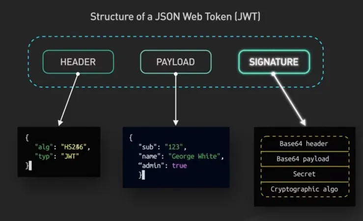
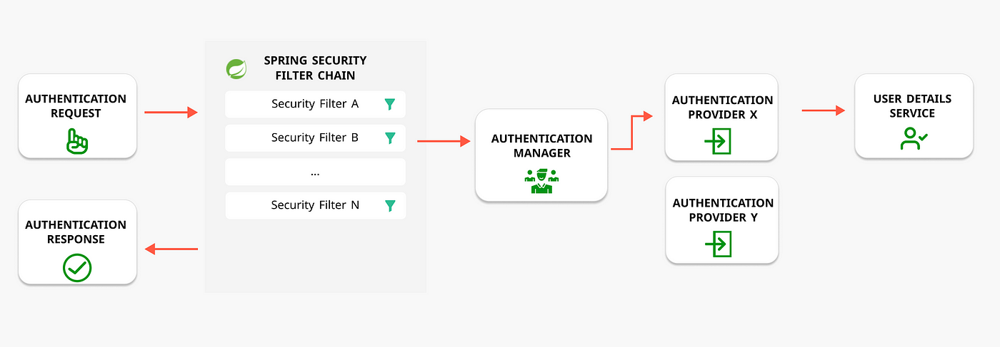

### Spring Security Using JWT Authentication

Required Tools

* Java 21
* Any IDE based on your preference
* Postman

### What is Jwt

JWT stands for JSON Web Token, which is an open standard for securely transmitting information as a JSON object between parties, typically a client and a server.

* Jwt Token Format *
 

* Implementation Class Details *

JwtAuthenticationFilter - Handle the Jwt Authentication Logic

JwtUtils: Utility Methods to extract the details from Header

JwtAuthenticationEntryPoint - To handle the JWT Authentication Errors

ApplicationSecurityConfig - To handle the request from Filter chain

### Authentication Flow

* Authentication Controller - For API to handle the requests for Signup and Sign-in

* AppRole & AppUser entities to store user information and privileges for authorization

* AppRoleRepo & AppUserRepo to store the data to db using JPA Implementation

* AppUserDetails & ApUserDetailsService are the security class implementations to find the user details from db to perform authentication

